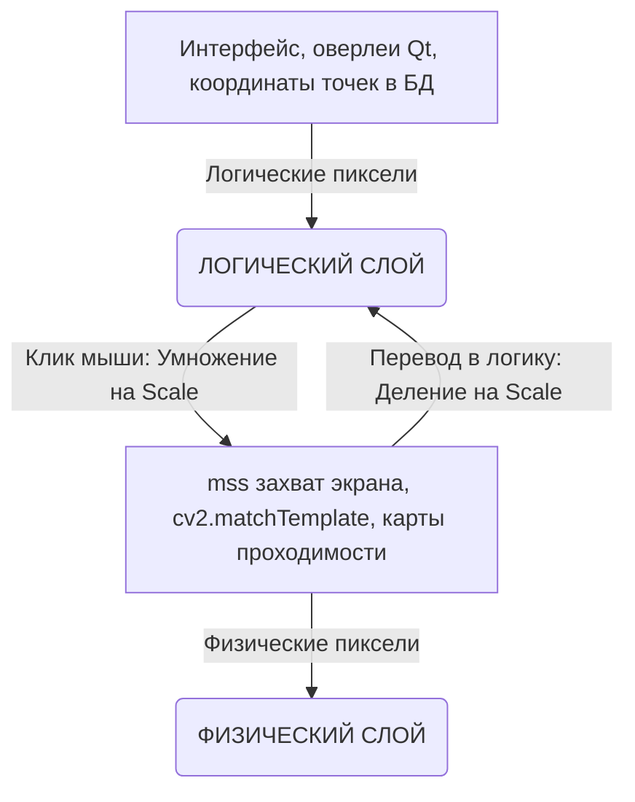

# Архитектура проекта XP Hero Bot

Данный документ описывает модульную архитектуру визуального бота для игры "XP Hero", работающего через Android-эмулятор. Бот основан исключительно на Computer Vision и не взаимодействует с памятью игры.

## Файловая структура

```text
xp_hero_bot/
│
├── src/                      # Исходный код бота
│   ├── main.py               # Точка входа в приложение
│   ├── vision/               # Vision Module (cv2, yolo, ocr)
│   │   ├── capture.py        # Захват экрана (mss)
│   │   ├── detector.py       # Детекция объектов (YOLOv8/11)
│   │   └── ocr.py            # Распознавание текста (EasyOCR)
│   │
│   ├── navigation/           # Navigation & Mapping Module
│   │   ├── map_engine.py     # Обработка карты коллизий
│   │   └── pathfinder.py     # Алгоритм A* (pathfinding)
│   │
│   ├── logic/                # Logic & State Machine
│   │   ├── fsm.py            # Реализация состояний бота (IDLE, COMBAT, etc.)
│   │   └── tasks/            # Отдельные сценарии поведения
│   │
│   ├── control/              # Модуль эмуляции ввода
│   │   ├── emulator_adb.py   # Отправка команд через ADB (pure-python-adb)
│   │   └── emulator_gui.py   # Резервное управление мышью (PyAutoGUI)
│   │
│   ├── gui/                  # GUI & Scheduler Module (PyQt6)
│   │   ├── main_window.py    # Главное окно (Main Thread)
│   │   ├── worker.py         # Поток выполнения бота (QThread)
│   │   └── scheduler.py      # Планировщик задач (APScheduler)
│   │
│   └── tools/                # Вспомогательные утилиты
│       └── mapper.py         # Mapper Utility (утилита снятия координат)
│
├── config/                   # Конфигурации и данные
│   ├── settings.json         # Глобальные настройки бота
│   └── locations.json        # База данных координат и точек интереса
│
├── models/                   # Модели машинного обучения
│   ├── yolo_weights.pt       # Модели для детекции YOLO
│   └── maps/                 # Карты и маски коллизий
│       └── collision_mask.png
│
├── requirements.txt          # Зависимости Python
└── ARCHITECTURE.md           # Этот файл (описание архитектуры)
```

## Форматы хранения данных (JSON)

### `config/settings.json`

Файл отвечает за глобальные настройки работы бота, эмулятора и алгоритмов машинного зрения. 

```json
{
  "emulator": {
    "window_name": "LDPlayer",
    "use_adb": true,
    "adb_port": 5555,
    "resolution": {"width": 1280, "height": 720}
  },
  "vision": {
    "confidence_threshold": 0.7,
    "ocr_lang": ["en", "ru"],
    "yolo_model_path": "../models/yolo_weights.pt"
  },
  "scheduler": {
    "enable_daily_quests": true,
    "farm_duration_minutes": 120
  }
}
```

### `config/locations.json`

Файл базы данных координат (сборник "точек" на экране эмулятора). Генерируется и пополняется через встроенную программу-помощник (`Mapper Utility`). 

```json
{
  "buttons": {
    "auto_battle": {"x": 1150, "y": 650, "type": "static"},
    "close_menu": {"x": 1200, "y": 50, "type": "static"}
  },
  "world_objects": {
    "boss_spawn": {"x": 500, "y": 400, "type": "map_coord"}
  },
  "ui_elements": {
    "health_bar": {
      "region": {"x1": 100, "y1": 50, "x2": 400, "y2": 70},
      "type": "dynamic_read"
    }
  }
}
```

- **type**: 
  - `static` (постоянная координата на экране), 
  - `map_coord` (координата на игровой карте, требующая навигации), 
  - `dynamic_read` (область/регион для чтения характеристик через OCR или OpenCV).

---

## Система координат, DPI-масштабирование и Навигация

Для обеспечения стабильной работы бота на любых мониторах (с разным разрешением и масштабом Windows) в проекте реализовано жесткое разделение областей видимости координат и физики движения.

### 1. Единый стандарт координатных сеток (DPI)

Вся система разделена на два изолированных слоя:



#### Логический слой (Logical Space)
* **Где применяется:** База данных точек (`coords_list`), оверлеи выбора координат (`PickerOverlay`), вычисление траектории движения, углов поворота, "динамических морковок" и расстояний до цели.
* **Почему:** Qt и операционная система Windows работают с логическими пикселями. Это гарантирует, что координаты кнопок и целей остаются одинаковыми вне зависимости от того, включен ли масштаб 100%, 125% или 150%.

#### Физический слой (Physical Space)
* **Где применяется:** Захват скриншотов через `mss` (захватывает сырой буфер видеокарты), OpenCV-сопоставление шаблонов (`cv2.matchTemplate` сопоставляет физический шаблон `mark.png` с физическим скриншотом), рисование карт проходимости (`walkability.png`) и отправка системных кликов (`pyautogui`).

#### Правила трансляции координат:
1. **Перевод из физических в логические:**
   $$\text{Logical} = \frac{\text{Physical}}{\text{Scale}}$$
   *Пример (нахождение маркера):* `found_x_logical = region_left + max_loc_phys[0] / scale`
2. **Перевод из логических в физические:**
   $$\text{Physical} = \text{Logical} \times \text{Scale}$$
   *Пример (клик мыши в джойстик):* `pyautogui.click(logical_x * scale, logical_y * scale)`

> [!IMPORTANT]
> **Правило смещения центра шаблона (Centering Offset):**
> Смещение прицела маркера (`centering_x`, `centering_y`) определяется кликом по оригинальному файлу `mark.png`, поэтому оно задается в **физических пикселях шаблона**.
> - В физической среде (запись пути в `map_recorder.py`): смещение прибавляется напрямую к результату OpenCV: `max_loc + centering_offset`.
> - В логической среде (детектор `AutoDetector` и позиция в `TestMoveThread`): смещение переводится в логические пиксели перед сложением: `(max_loc + centering_offset) / scale`.

---

### 2. Физика движения и Алгоритмы навигации

Бот использует продвинутые алгоритмы теории управления для ликвидации инерции персонажа и компенсации лагов захвата экрана эмулятора.

#### А. Поиск пути Theta* (Theta-Star Pathfinding)
* Путь планируется по физической сетке проходимости `walkability.png`.
* Алгоритм **Theta*** отличается от классического A* тем, что он проверяет прямую видимость (Line of Sight) от родительского узла к соседним. Это позволяет строить сглаженные траектории по диагоналям под любыми углами вместо ломаных "лесенок".
* Выходной путь конвертируется обратно в логические координаты перед передачей в поток движения бота.

#### Б. Динамическая «Виртуальная Морковка» (Adaptive Pure Pursuit)
Для плавного движения без заносов и срезания углов бот использует адаптивный радиус упреждения (Lookahead Distance):
* **На прямых участках:** Радиус расширяется до максимального значения (`nav_lookahead_straight`, по умолчанию `5.5 px`). Бот "смотрит далеко вперед", сглаживая бег и развивая максимальную скорость.
* **На крутых поворотах:** При обнаружении впереди изгиба траектории радиус сжимается до минимума (`nav_lookahead_turn_min`, по умолчанию `1.5 px`). Бот начинает целиться точно в вершину угла, предотвращая "срезание" и застревание в текстурах стен.

#### В. Тактика гашения инерции «Stop-and-Turn»
Из-за высокой инерции движения в эмуляторе и задержек эмуляции аналогового джойстика персонаж может пролетать мимо вейпоинтов:
* При достижении вершины крутого угла бот полностью отпускает джойстик на фиксированное время (`nav_stop_turn_pause`, по умолчанию `150 мс`).
* Физическая скорость персонажа падает до нуля, гася инерцию, после чего бот мгновенно прожимает джойстик в сторону следующего вейпоинта. Это гарантирует идеальное прохождение углов на 90 градусов.

#### Г. Динамическое сглаживание и Ликвидация Лага (Lag Prevention)
Для фильтрации шума детекции координат используется экспоненциальный фильтр (EMA):
$$\text{SmoothCoord} = \alpha \times \text{RawCoord} + (1 - \alpha) \times \text{PrevSmoothCoord}$$
* По умолчанию фильтрация сглаживает скачки координат ($\alpha \approx 0.4$).
* **Ликвидация лага:** При приближении к важным точкам (к поворотам ближе 10 пикселей или к финишу ближе 15 пикселей) коэффициент $\alpha$ автоматически устремляется к `1.0` (фильтр полностью отключается). Бот переходит на мгновенное чтение "сырых" координат, благодаря чему тормозной путь (`early_stop`) срабатывает без задержек и персонаж останавливается точно в цели.

